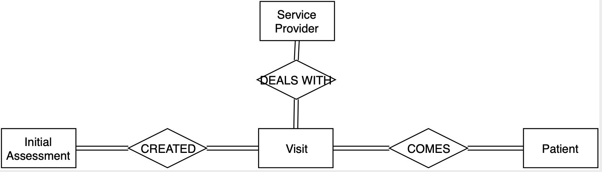
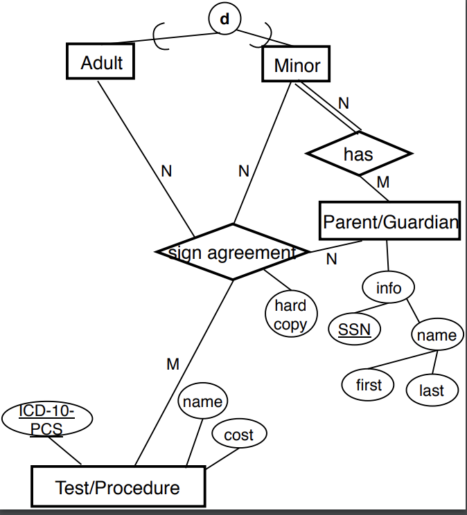

# Description of the ER Diagram

Most of the Diagrams can be fixed by triggers. Therefore, instead of changing the whole ER diagram, we thought about what could have made our data more efficient.

1. Visit entity
We had some problem with relations and sharing data. For example, if a patient and a service provider are meeting, initial assessment, which is directly connected together, have to have some type of triggers or join function to get the full information of patients. To avoid these unnecessary steps, we decided having 'visit' entity can be useful.

 

2. Minor/Adult Sign Agreement
Another issue was the Minor and Adult relationship. In our previous model, adult and minor had different relationship with test/procedure.
Since we figure that adult, minor, parent/guardian shared similiar information, instead of having a separate trigger, we decided to connect the relationship with each other.

 
